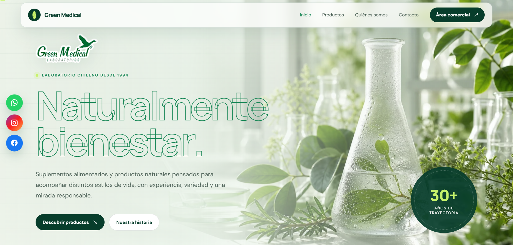
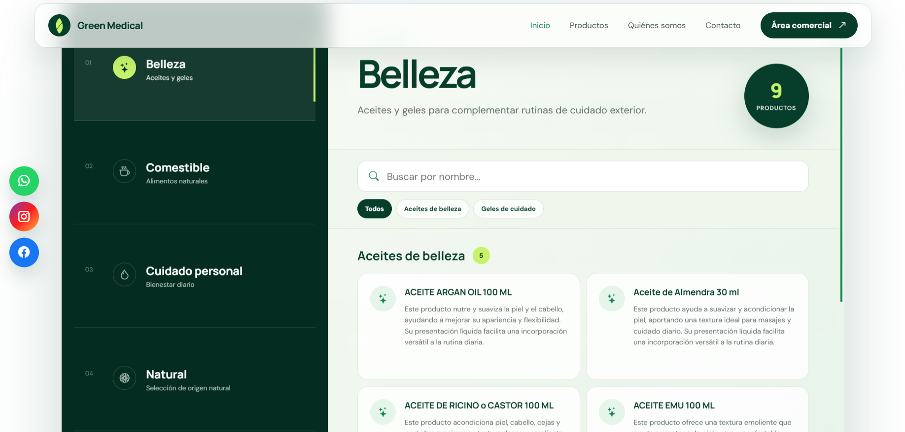
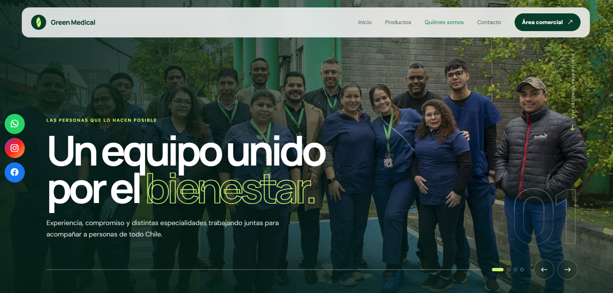
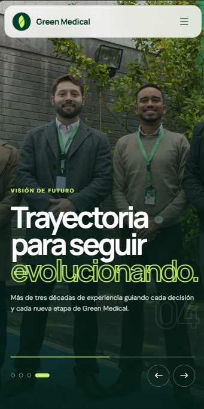
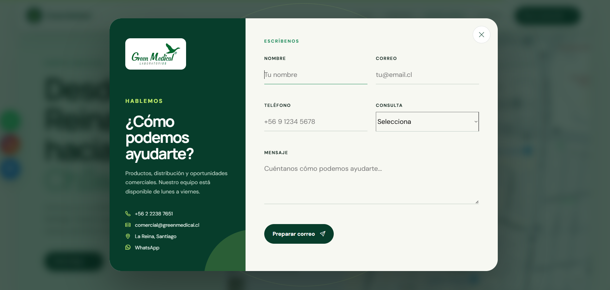

# Green Medical

Sitio web corporativo de **Green Medical Laboratorios**, empresa chilena dedicada a suplementos alimentarios y productos naturales desde 1994.

El proyecto presenta la empresa, sus categorías de productos, instalaciones, clientes y canales de contacto mediante una experiencia visual adaptable a escritorio, tablet y dispositivos móviles.



## Capturas

### Catálogo interactivo



### Quiénes somos



### Experiencia móvil

<p align="center">
  
</p>

### Contacto comercial



## Vista general

- Página de inicio con presentación institucional y catálogo interactivo.
- Catálogo local con búsqueda y filtros por subcategoría.
- Video institucional con control de sonido.
- Página corporativa con historia, valores, carrusel y ubicación.
- Página de contacto con validación de formulario.
- Modal de contacto disponible desde distintas llamadas a la acción.
- Integración con correo, teléfono, WhatsApp y Google Maps.
- Animaciones de entrada, navegación móvil y barra de progreso de lectura.
- Compatibilidad con la preferencia `prefers-reduced-motion`.
- Diseño responsive sin frameworks de JavaScript.

## Tecnologías

- HTML5
- CSS3
- JavaScript nativo
- [Google Fonts](https://fonts.google.com/)
- [Bootstrap Icons](https://icons.getbootstrap.com/)
- Google Maps mediante iframe y enlaces externos

No requiere base de datos, PHP, Node.js, npm ni proceso de compilación.

## Estructura del proyecto

```text
GreenMedical/
|-- index.html                 # Inicio y catálogo de productos
|-- nosotros.html             # Historia, valores, equipo y ubicación
|-- contacto.html             # Canales y formulario de contacto
|-- css/
|   `-- styles.css             # Estilos generales y responsive
|-- js/
|   |-- app.js                 # Interacciones, formularios y animaciones
|   `-- catalog-data.js        # Información detallada del catálogo
`-- assets/
    |-- readme/                # Capturas utilizadas en este documento
    |-- brands/                # Logotipos de clientes y distribuidores
    |-- *.webp                 # Imágenes optimizadas del sitio
    |-- logo-original.png      # Logotipo de Green Medical
    `-- video-institucional.mp4
```

## Ejecución local

### Con XAMPP

1. Verifica que el proyecto se encuentre en:

   ```text
   C:\xampp\htdocs\GreenMedical
   ```

2. Inicia Apache desde el panel de XAMPP.
3. Abre en el navegador:

   ```text
   http://localhost/GreenMedical/
   ```

### Con un servidor HTTP alternativo

Si tienes Python instalado, también puedes ejecutar:

```powershell
cd C:\xampp\htdocs\GreenMedical
python -m http.server 8000
```

Luego visita `http://localhost:8000/`.

> Se recomienda usar un servidor HTTP en lugar de abrir los archivos directamente con `file:///` para reproducir el comportamiento real del sitio.

## Páginas

| Archivo | Contenido |
| --- | --- |
| `index.html` | Portada, propuesta de valor, catálogo, beneficios, laboratorio, clientes y llamada comercial. |
| `nosotros.html` | Carrusel institucional, historia, principios, equipo, dirección y mapa. |
| `contacto.html` | Datos comerciales, formulario de contacto y acceso a Google Maps. |

## Catálogo

La información detallada de productos se encuentra en `js/catalog-data.js` y se expone en `window.GREEN_MEDICAL_CATALOG`.

Las categorías principales son:

- Belleza
- Comestible
- Cuidado personal
- Natural
- Suplemento

Para agregar o modificar productos, edita los objetos de la categoría correspondiente respetando la estructura existente. `js/app.js` genera automáticamente las tarjetas, el buscador, los filtros y los estados sin resultados.

## Formulario de contacto

El formulario valida en el navegador y envía los datos mediante `fetch` al endpoint PHP `contacto.php`. El backend repite la validación, incorpora un campo honeypot, limita envíos consecutivos y entrega el mensaje a `comercial@greenmedical.cl` mediante la función `mail()` de PHP.

En producción, el hosting debe tener el envío de correo PHP configurado. El destinatario puede cambiarse mediante la variable de entorno `GREENMEDICAL_CONTACT_TO`. Si el proveedor no ofrece correo saliente, configura SMTP en el servidor o sustituye el endpoint por Formspree o EmailJS.

## Personalización

### Datos de contacto

Los datos comerciales aparecen en los archivos HTML y en `js/app.js`. Al cambiarlos, revisa todas sus apariciones para mantener consistencia:

- Correo: `comercial@greenmedical.cl`
- Teléfono: `+56 2 2238 7651`
- Dirección: Los Ebanistas #8521, La Reina, Santiago
- Horario: lunes a viernes, de 8:30 a 17:30 hrs.

### Colores y tipografías

La identidad visual se administra principalmente mediante variables CSS declaradas al comienzo de `css/styles.css`. Las tipografías utilizadas son **DM Sans** y **Manrope**.

### Imágenes y video

Los recursos visuales están en `assets/`. Conserva los nombres actuales al reemplazarlos o actualiza las rutas correspondientes en los archivos HTML.

El video institucional es el archivo `assets/video-institucional.mp4`. Se carga de forma diferida cuando el visitante se acerca a la sección, evitando descargarlo durante la carga inicial. Si se reemplaza, se recomienda exportarlo en H.264, resolución máxima de 1080p, con el audio y bitrate ajustados al uso web.

Las fotografías principales están limitadas a 1600 px y guardadas como WebP. Al incorporar recursos nuevos, conserva dimensiones similares y añade `width`, `height`, `loading="lazy"` y `decoding="async"` cuando no sean imágenes críticas de la primera pantalla.

La vista previa para redes usa `assets/og-green-medical.jpg` (1200 x 630) y los favicons están en `assets/favicon.svg`, `assets/favicon-32.png` y `assets/apple-touch-icon.png`.

## Dependencias externas

El sitio carga desde internet:

- Google Fonts
- Bootstrap Icons desde jsDelivr
- Mapas de Google
- Enlaces a sitios, redes sociales y canales externos

Si el visitante no tiene conexión, el contenido local seguirá disponible, pero las fuentes, iconos, mapas y enlaces externos podrían no mostrarse correctamente.

## Despliegue

Al ser un sitio estático, puede publicarse en cualquier hosting que sirva archivos HTML, CSS, JavaScript, imágenes y video. Antes de desplegar:

1. Comprueba los enlaces de navegación y contacto.
2. Verifica el sitio en escritorio y móvil.
3. Confirma que el video y las imágenes estén optimizados.
4. Revisa que el dominio use HTTPS.
5. Configura caché y compresión en el servidor cuando estén disponibles.

### Prueba en un teléfono real

La simulación responsive ayuda a detectar problemas de layout, pero no sustituye una prueba física. Para revisar el sitio desde un teléfono conectado a la misma red que el equipo:

1. Inicia Apache en XAMPP y consulta la dirección IPv4 del equipo con `ipconfig`.
2. Abre `http://DIRECCION-IP/GreenMedical/` en Safari iOS y Chrome Android.
3. Comprueba el menú, el modal de contacto, teclado y campos del formulario, enlaces de teléfono/WhatsApp, reproducción y sonido del video, orientación vertical/horizontal y desplazamiento lateral.
4. Repite una carga con datos móviles o una red lenta para confirmar que la portada aparece antes de que se descargue el video.
5. Envía un mensaje de prueba únicamente después de configurar el correo saliente del hosting y confirma tanto la recepción como la carpeta de spam.

## Información legal

El contenido del sitio es de carácter general. La disponibilidad y presentación de los productos puede variar; los visitantes deben consultar al área comercial y revisar siempre el etiquetado correspondiente.

## Licencia

Este repositorio no incluye actualmente una licencia pública. Su contenido debe considerarse de uso privado de Green Medical salvo autorización expresa de sus responsables.
